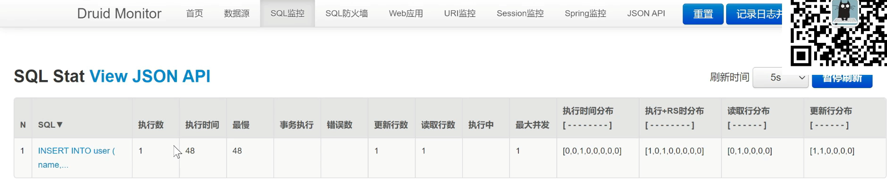
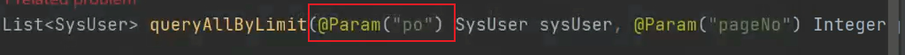
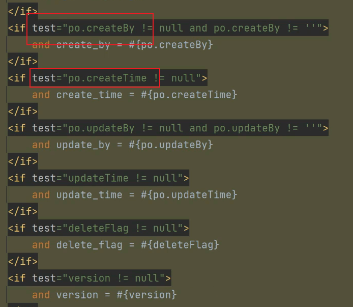
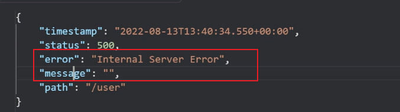
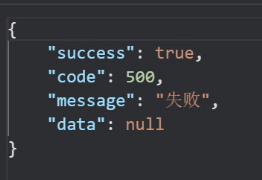
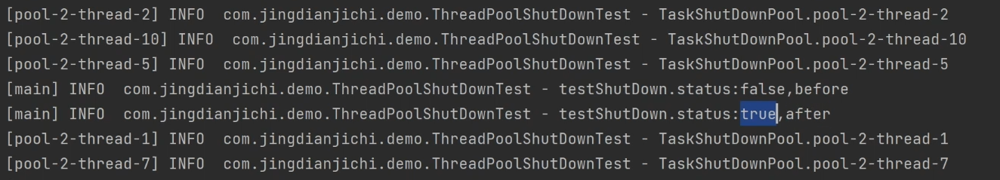

# 集成Mybatis-plus模块

### po，dto区别

po只和数据层进行交互，dto可以实现多个po聚合，进行数据体的转换

### 元数据处理

在插入数据的时候会有一些create_by，create_time等一些数据，手动进行填充会使代码冗余，且没有实际意义，所以需要简化自己的处理方式。

当处理相同逻辑的数据库字段的插入和更新时候，可以继承MetaObjectHandler类，实现insert，update两个方法，

```java
@Component
public class MyMetaObjectHandler implements MetaObjectHandler {

    @Override
    public void insertFill(MetaObject metaObject) {
        this.strictInsertFill(metaObject, "createBy", String.class, "jingdianjichi");
        this.strictInsertFill(metaObject, "createTime", Date.class, new Date());
        this.strictInsertFill(metaObject, "deleteFlag", Integer.class, 0);
        this.strictInsertFill(metaObject, "version", Integer.class, 0);
    }

    @Override
    public void updateFill(MetaObject metaObject) {
        this.strictUpdateFill(metaObject, "updateBy", String.class, "jingdianjichi");
        this.strictUpdateFill(metaObject, "updateTime", Date.class, new Date());
    }
}
```

附加：version字段为后续的乐观锁做准备

### 集成druid监控

```yml
spring:
	datasource:
	 druid:
      initial-size: 20
      min-idle: 20
      max-active: 100
      max-wait: 60000
      stat-view-servlet:
        enabled: true
        url-pattern: /druid/*
        login-username: admin
        login-password: 123456
      filter:
        stat:
          enabled: true
          log-slow-sql: true
          slow-sql-millis: 2000 #设置超过2秒为慢查询
        wall: 
          enabled: true #启动sql防火墙          
```

可以通过8081/druid/login.html进行登录监控系统查看sql执行情况



### 集成mp插件

集成公用拦截器插件

```java
package com.jingdianjichi.inteceptor;

import org.apache.ibatis.executor.statement.StatementHandler;
import org.apache.ibatis.mapping.BoundSql;
import org.apache.ibatis.mapping.ParameterMapping;
import org.apache.ibatis.plugin.*;
import org.apache.ibatis.session.ResultHandler;
import org.apache.ibatis.session.defaults.DefaultSqlSession.StrictMap;

import java.lang.reflect.Field;
import java.sql.Statement;
import java.util.*;

@Intercepts(value = {
        @Signature(args = {Statement.class, ResultHandler.class}, method = "query", type = StatementHandler.class),
        @Signature(args = {Statement.class}, method = "update", type = StatementHandler.class),
        @Signature(args = {Statement.class}, method = "batch", type = StatementHandler.class)})
public class SqlBeautyInterceptor implements Interceptor {

    @Override
    public Object intercept(Invocation invocation) throws Throwable {
        Object target = invocation.getTarget();
        long startTime = System.currentTimeMillis();
        StatementHandler statementHandler = (StatementHandler) target;
        try {
            return invocation.proceed();
        } finally {
            long endTime = System.currentTimeMillis();
            long sqlCost = endTime - startTime;
            BoundSql boundSql = statementHandler.getBoundSql();
            String sql = boundSql.getSql();
            Object parameterObject = boundSql.getParameterObject();
            List<ParameterMapping> parameterMappingList = boundSql.getParameterMappings();
            sql = formatSql(sql, parameterObject, parameterMappingList);
            System.out.println("SQL： [ " + sql + " ]执行耗时[ " + sqlCost + "ms ]");
        }
    }

    @Override
    public Object plugin(Object o) {
        return Plugin.wrap(o, this);
    }

    @Override
    public void setProperties(Properties properties) {
    }

    private String formatSql(String sql, Object parameterObject, List<ParameterMapping> parameterMappingList) {
        if (sql == "" || sql.length() == 0) {
            return "";
        }
        sql = beautifySql(sql);
        if (parameterObject == null || parameterMappingList == null || parameterMappingList.size() == 0) {
            return sql;
        }
        String sqlWithoutReplacePlaceholder = sql;
        try {
            if (parameterMappingList != null) {
                Class<?> parameterObjectClass = parameterObject.getClass();
                if (isStrictMap(parameterObjectClass)) {
                    StrictMap<Collection<?>> strictMap = (StrictMap<Collection<?>>) parameterObject;
                    if (isList(strictMap.get("list").getClass())) {
                        sql = handleListParameter(sql, strictMap.get("list"));
                    }
                } else if (isMap(parameterObjectClass)) {
                    Map<?, ?> paramMap = (Map<?, ?>) parameterObject;
                    sql = handleMapParameter(sql, paramMap, parameterMappingList);
                } else {
                    sql = handleCommonParameter(sql, parameterMappingList, parameterObjectClass, parameterObject);
                }
            }
        } catch (Exception e) {
            return sqlWithoutReplacePlaceholder;
        }
        return sql;
    }


    private String handleCommonParameter(String sql, List<ParameterMapping> parameterMappingList,
                                         Class<?> parameterObjectClass, Object parameterObject) throws Exception {
        Class<?> originalParameterObjectClass = parameterObjectClass;
        List<Field> allFieldList = new ArrayList<>();
        while (parameterObjectClass != null) {
            allFieldList.addAll(new ArrayList<>(Arrays.asList(parameterObjectClass.getDeclaredFields())));
            parameterObjectClass = parameterObjectClass.getSuperclass();
        }
        Field[] fields = new Field[allFieldList.size()];
        fields = allFieldList.toArray(fields);
        parameterObjectClass = originalParameterObjectClass;
        for (ParameterMapping parameterMapping : parameterMappingList) {
            String propertyValue = null;
            if (isPrimitiveOrPrimitiveWrapper(parameterObjectClass)) {
                propertyValue = parameterObject.toString();
            } else {
                String propertyName = parameterMapping.getProperty();
                Field field = null;
                for (Field everyField : fields) {
                    if (everyField.getName().equals(propertyName)) {
                        field = everyField;
                    }
                }
                field.setAccessible(true);
                propertyValue = String.valueOf(field.get(parameterObject));
                if (parameterMapping.getJavaType().isAssignableFrom(String.class)) {
                    propertyValue = "\"" + propertyValue + "\"";
                }
            }
            sql = sql.replaceFirst("\\?", propertyValue);
        }
        return sql;
    }

    private String handleMapParameter(String sql, Map<?, ?> paramMap, List<ParameterMapping> parameterMappingList) {
        for (ParameterMapping parameterMapping : parameterMappingList) {
            Object propertyName = parameterMapping.getProperty();
            Object propertyValue = paramMap.get(propertyName);
            if (propertyValue != null) {
                if (propertyValue.getClass().isAssignableFrom(String.class)) {
                    propertyValue = "\"" + propertyValue + "\"";
                }

                sql = sql.replaceFirst("\\?", propertyValue.toString());
            }
        }
        return sql;
    }

    private String handleListParameter(String sql, Collection<?> col) {
        if (col != null && col.size() != 0) {
            for (Object obj : col) {
                String value = null;
                Class<?> objClass = obj.getClass();
                if (isPrimitiveOrPrimitiveWrapper(objClass)) {
                    value = obj.toString();
                } else if (objClass.isAssignableFrom(String.class)) {
                    value = "\"" + obj.toString() + "\"";
                }

                sql = sql.replaceFirst("\\?", value);
            }
        }
        return sql;
    }

    private String beautifySql(String sql) {
        sql = sql.replaceAll("[\\s\n ]+", " ");
        return sql;
    }

    private boolean isPrimitiveOrPrimitiveWrapper(Class<?> parameterObjectClass) {
        return parameterObjectClass.isPrimitive() || (parameterObjectClass.isAssignableFrom(Byte.class)
                || parameterObjectClass.isAssignableFrom(Short.class)
                || parameterObjectClass.isAssignableFrom(Integer.class)
                || parameterObjectClass.isAssignableFrom(Long.class)
                || parameterObjectClass.isAssignableFrom(Double.class)
                || parameterObjectClass.isAssignableFrom(Float.class)
                || parameterObjectClass.isAssignableFrom(Character.class)
                || parameterObjectClass.isAssignableFrom(Boolean.class));
    }

    /**
     * 是否DefaultSqlSession的内部类StrictMap
     */
    private boolean isStrictMap(Class<?> parameterObjectClass) {
        return parameterObjectClass.isAssignableFrom(StrictMap.class);
    }

    /**
     * 是否List的实现类
     */
    private boolean isList(Class<?> clazz) {
        Class<?>[] interfaceClasses = clazz.getInterfaces();
        for (Class<?> interfaceClass : interfaceClasses) {
            if (interfaceClass.isAssignableFrom(List.class)) {
                return true;
            }
        }

        return false;
    }

    /**
     * 是否Map的实现类
     */
    private boolean isMap(Class<?> parameterObjectClass) {
        Class<?>[] interfaceClasses = parameterObjectClass.getInterfaces();
        for (Class<?> interfaceClass : interfaceClasses) {
            if (interfaceClass.isAssignableFrom(Map.class)) {
                return true;
            }
        }
        return false;
    }

}
```

在配置类中将拦截器插件导入进来

```java
 	@Bean
    public SqlBeautyInterceptor sqlBeautyInterceptor() {
        return new SqlBeautyInterceptor();
    }

```

#### 优化

使用Conditional注解

在一定情况下，对于一些业务方可能不需要一些插件，可以使用@Conditional系列注解进行指定特定情况下开启

```java
  	@Bean
    @ConditionalOnProperty(name = {"sql.beauty.show"}, havingValue = "true", matchIfMissing = true)
    public SqlBeautyInterceptor sqlBeautyInterceptor() {
        return new SqlBeautyInterceptor();
    }
```

### 共有实体抽取

需要实现序列化接口

```java
package com.jingdianjichi.entity;

import com.baomidou.mybatisplus.annotation.FieldFill;
import com.baomidou.mybatisplus.annotation.TableField;
import com.baomidou.mybatisplus.annotation.TableLogic;
import lombok.Data;

import java.io.Serializable;
import java.util.Date;

@Data
public class BaseEntity implements Serializable {

    @TableField(fill = FieldFill.INSERT)
    private String createBy;

    @TableField(fill = FieldFill.INSERT)
    private Date createTime;

    @TableField(fill = FieldFill.UPDATE)
    private String updateBy;

    @TableField(fill = FieldFill.UPDATE)
    private Date updateTime;

    @TableField(fill = FieldFill.INSERT)
    @TableLogic
    private Integer deleteFlag;

    @TableField(fill = FieldFill.INSERT)
    private Integer version;

}
```

 	

### pageresult

```java
@Data
public class PageResult<T> implements Serializable {

    private Long total;

    private Long size;

    private Long current;

    private Long pages;

    private List<T> records = Collections.emptyList();

    public void loadData(IPage<T> pageData){
        this.setCurrent(pageData.getCurrent());
        this.setPages(pageData.getPages());
        this.setSize(pageData.getSize());
        this.setTotal(pageData.getTotal());
        this.setRecords(pageData.getRecords());
    }

}

```

### Param注解



当我们打上了@Param注解，需要对应在mappering文件中加上前缀



### 抽取公共page类

#### 分页pageRequest

抽取分页算法所需要的两个参数为公共类

```java
@Setter
public class PageRequest {

    private Long pageNo = 1L;

    private Long pageSize = 10L;

    //进行参数判断
    public Long getPageNo(){
        if(pageNo == null || pageNo < 1){
            return 1L;
        }
        return pageNo;
    }

    public Long getPageSize(){
        if(pageSize == null || pageSize < 1 || pageSize > Integer.MAX_VALUE){
            return 10L;
        }
        return pageSize;
    }

}

```

### 集成mapstruct

beansUtils.copyProperties效率比较低 ，所以我们引入mapStruct

创建convert，定义一个接口

```java
//Mapper属于org.mapstruct
@Mapper
public interface SysUserConverter {
    SysUserConverter INSTANCE = Mappers.getMapper(SysUserConverter.class);
    //如果属性名不一样的情况可以使用Mapping注解来进行字段映射
    @Mapping(source="age", target="age1")
    SysUser convertReqToSysUser(SysUserReq sysUserReq);
}
//使用,将req对象映射到user对象 	 
SysUser  sysUser = SysUserConverter。INSTANCE.convertReqToSysUser(sysUserReq);

```


# 集成Web模块

### 全局异常处理

#### 异常处理注解

@[RestControllerAdvice](https://so.csdn.net/so/search?q=RestControllerAdvice&spm=1001.2101.3001.7020)主要用精简客户端返回异常，它可以捕获各种异常


处理步骤

配置异常拦截器

```java
@RestControllerAdvice
public class ExceptionAdaptController {

    @ExceptionHandler({RuntimeException.class})
    public Result runTimeException(RuntimeException exception){
        exception.printStackTrace();
        return Result.fail();
    }

    @ExceptionHandler({Exception.class})
    public Result exception(Exception exception){
        exception.printStackTrace();
        return Result.fail();
    }
}
 	
```


#### 处理前后对比

处理前

```java
int i = 1/0;
```

对于前端来说，返回的信息，无法识别



处理后



## 集成WebSocket

导入spring-boot-starter-websocket

添加webSocket配置类

```java
@Configuration
public class WebSocketConfig {

    @Bean
    public ServerEndpointExporter serverEndpointExporter() {
        return new ServerEndpointExporter();
    }

}
```

```java
@Component
public class WebSocketServerConfig extends ServerEndpointConfig.Configurator {

    @Override
    public boolean checkOrigin(String originHeaderValue) {
        ServletRequestAttributes servletRequestAttributes = (ServletRequestAttributes) RequestContextHolder.getRequestAttributes();
        HttpServletRequest request = servletRequestAttributes.getRequest();
        return true;
    }

    @Override
    public void modifyHandshake(ServerEndpointConfig sec, HandshakeRequest request, HandshakeResponse response) {
        Map<String, List<String>> parameterMap = request.getParameterMap();
        List<String> erpList = parameterMap.getOrDefault("erp", null);
        if (!CollectionUtils.isEmpty(erpList)) {
            sec.getUserProperties().put("erp", erpList.get(0));
        }
    }

}
```

WebSocket要保证操作的原子性，所以使用AutomicInt

```java
@Slf4j
@ServerEndpoint(value = "/chicken/socket", configurator = WebSocketServerConfig.class)
@Component
public class ChickenSocket {

    /**
     * 记录当前在线连接数
     */
    private static AtomicInteger onlineCount = new AtomicInteger(0);

    /**
     * 存放所有在线的客户端
     */
    private static Map<String, ChickenSocket> clients = new ConcurrentHashMap<>();

    /**
     * 与某个客户端的连接会话，需要通过它来给客户端发送数据
     */
    private Session session;

    /**
     * erp唯一标识
     */
    private String erp = "";

    /**
     * 连接建立成功调用的方法
     */
    @OnOpen
    public void onOpen(Session session, EndpointConfig conf) throws IOException {
        //获取用户信息
        try {
            Map<String, Object> userProperties = conf.getUserProperties();
            String erp = (String) userProperties.get("erp");
            this.erp = erp;
            this.session = session;
            //如果电脑端已连接，现在在手机端再次连接，需要进行判断，如果存在，则将电脑端移除。
            if (clients.containsKey(this.erp)) {
                clients.get(this.erp).session.close();
                clients.remove(this.erp);
                onlineCount.decrementAndGet();
            }
            //移除后将手机端的erp放入
            clients.put(this.erp, this);
            onlineCount.incrementAndGet();
            log.info("有新连接加入：{}，当前在线人数为：{}", erp, onlineCount.get());
            sendMessage("连接成功", this.session);
        } catch (Exception e) {
            log.error("建立链接错误{}", e.getMessage(), e);
        }
    }

    /**
     * 连接关闭调用的方法
     */
    @OnClose
    public void onClose() {
        try {
            if (clients.containsKey(erp)) {
                clients.get(erp).session.close();
                clients.remove(erp);
                onlineCount.decrementAndGet();
            }
            log.info("有一连接关闭：{}，当前在线人数为：{}", this.erp, onlineCount.get());
        } catch (Exception e) {
            log.error("连接关闭错误，错误原因{}", e.getMessage(), e);
        }
    }

    /**
     * 收到客户端消息后调用的方法
     */
    @OnMessage
    public void onMessage(String message, Session session) {
        log.info("服务端收到客户端[{}]的消息:{}", this.erp, message);
        //心跳机制
        if (message.equals("ping")) {
            this.sendMessage("pong", session);
        }
    }

    @OnError
    public void onError(Session session, Throwable error) {
        log.error("Socket:{},发生错误,错误原因{}", erp, error.getMessage(), error);
        try {
            session.close();
        } catch (Exception e) {
            log.error("onError.Exception{}", e.getMessage(), e);
        }
    }

    /**
     * 指定发送消息
     */
    public void sendMessage(String message, Session session) {
        log.info("服务端给客户端[{}]发送消息{}", this.erp, message);
        try {
            session.getBasicRemote().sendText(message);
        } catch (IOException e) {
            log.error("{}发送消息发生异常，异常原因{}", this.erp, message);
        }
    }

    /**
     * 群发消息
     */
    public void sendMessage(String message) {
        for (Map.Entry<String, ChickenSocket> sessionEntry : clients.entrySet()) {
            String erp = sessionEntry.getKey();
            ChickenSocket socket = sessionEntry.getValue();
            Session session = socket.session;
            log.info("服务端给客户端[{}]发送消息{}", erp, message);
            try {
                session.getBasicRemote().sendText(message);
            } catch (IOException e) {
                log.error("{}发送消息发生异常，异常原因{}", this.erp, message);
            }
        }
    }

}
```


## 集成Swagger模块

swagger具有代码侵入性，小公司会使用

优化：通过配置文件的形式来对Swagger进行定制。


```java
@Configuration
//swagger开关
@EnableSwagger2
public class SwaggerConfig {
//自动注入
    @Autowired
    private SwaggerInfo swaggerInfo;

    @Bean
    public Docket createRestApi() {
        return new Docket(DocumentationType.SWAGGER_2)
                .apiInfo(apiInfo())
                .select()
                .apis(RequestHandlerSelectors.basePackage(swaggerInfo.getBasePackage()))
                .paths(PathSelectors.any())
                .build();
    }

    public ApiInfo apiInfo() {
        return new ApiInfoBuilder()
                .title(swaggerInfo.getTitle())
                .contact(new Contact(swaggerInfo.getContactName(),
                        swaggerInfo.getContactUrl(),
                        swaggerInfo.getEmail()))
                .version(swaggerInfo.getVersion())
                .description(swaggerInfo.getDescription())
                .build();
    }

}
```

```java
package com.jingdianjichi.swagger.bean;

import org.springframework.boot.context.properties.ConfigurationProperties;
import org.springframework.stereotype.Component;

@Component
//通过配置的方式填充属性
@ConfigurationProperties(prefix = "swagger")
public class SwaggerInfo {

    private String basePackage;

    private String title;

    private String contactName;

    private String contactUrl;

    private String email;

    private String version;

    private String description;

    public String getContactUrl() {
        return contactUrl;
    }

    public void setContactUrl(String contactUrl) {
        this.contactUrl = contactUrl;
    }

    public String getBasePackage() {
        return basePackage;
    }

    public void setBasePackage(String basePackage) {
        this.basePackage = basePackage;
    }

    public String getTitle() {
        return title;
    }

    public void setTitle(String title) {
        this.title = title;
    }

    public String getContactName() {
        return contactName;
    }

    public void setContactName(String contactName) {
        this.contactName = contactName;
    }

    public String getEmail() {
        return email;
    }

    public void setEmail(String email) {
        this.email = email;
    }

    public String getVersion() {
        return version;
    }

    public void setVersion(String version) {
        this.version = version;
    }

    public String getDescription() {
        return description;
    }

    public void setDescription(String description) {
        this.description = description;
    }
}

```

# 集成Redis

新增配置：

```xml
spring:
 redis:
    host: 117.78.51.210
    port: 6379
    database: 0
#配置连接池
    lettuce:
      pool:
        max-active: 20
        max-idle: 8
        max-wait: -1
        min-idle: 0
    password: jingdianjichi
```

配置redis序列化器以及RedisTemplate

```java
@Configuration
public class RedisConfig {

    //RedisTemplate
    @Bean
    public RedisTemplate<String,Object> redisTemplate(RedisConnectionFactory redisConnectionFactory){
        RedisTemplate<String,Object> redisTemplate = new RedisTemplate<>();
        RedisSerializer<String> redisSerializer = new StringRedisSerializer();
        redisTemplate.setConnectionFactory(redisConnectionFactory);
        redisTemplate.setKeySerializer(redisSerializer);
        redisTemplate.setHashKeySerializer(redisSerializer);
        redisTemplate.setValueSerializer(jackson2JsonRedisSerializer());
        redisTemplate.setHashValueSerializer(jackson2JsonRedisSerializer());
        return redisTemplate;
    }

   //设置序列化器
    private Jackson2JsonRedisSerializer<Object> jackson2JsonRedisSerializer(){
        Jackson2JsonRedisSerializer<Object> jsonRedisSerializer = new Jackson2JsonRedisSerializer<>(Object.class);
        ObjectMapper objectMapper = new ObjectMapper();
        objectMapper.setVisibility(PropertyAccessor.ALL, JsonAutoDetect.Visibility.ANY);
        objectMapper.configure(DeserializationFeature.FAIL_ON_UNKNOWN_PROPERTIES,false);
        objectMapper.enableDefaultTyping(ObjectMapper.DefaultTyping.NON_FINAL, JsonTypeInfo.As.PROPERTY);
        jsonRedisSerializer.setObjectMapper(objectMapper);
        return jsonRedisSerializer;
    }

}
```

### 封装分布式锁

 参数校验可以使用common-logging包的StringUtils进行参数判断

```java
package com.jingdianjichi.redis.util;

import com.jingdianjichi.redis.exception.ShareLockException;
import org.apache.commons.lang.StringUtils;
import org.springframework.stereotype.Component;

import javax.annotation.Resource;
import java.util.concurrent.TimeUnit;

/**
 * @Author: ChickenWing
 * @Description: Redis分布式锁
 * @DateTime: 2022/9/24 22:28
 */
@Component
public class RedisShareLockUtil {

    @Resource
    private RedisUtil redisUtil;

    private Long TIME_OUT = 1000L;

    /**
     * @Author: ChickenWing
     * @Description: 加锁
     * @DateTime: 2022/9/24 21:25
     */
    //参数:localKey表示分布式锁的key，requestId作为value作为识别当前锁是不是之前添加的
    public boolean lock(String lockKey, String requestId, Long time) {
        //参数校验
        if (StringUtils.isBlank(lockKey) || StringUtils.isBlank(requestId) || time <= 0) {
            throw new ShareLockException("分布式锁-加锁参数异常");
        }
        long currentTime = System.currentTimeMillis();
        long outTime = currentTime + TIME_OUT;
        Boolean result = false;
        //加锁自旋
        while (currentTime < outTime) {
            //借助redis的setnx进行实现分布式锁
            result = redisUtil.setNx(lockKey, requestId, time, TimeUnit.MILLISECONDS);
            if (result) {
                return result;
            }
            //休息后继续自旋
            try {
                Thread.sleep(100);
            } catch (InterruptedException e) {
                e.printStackTrace();
            }
            currentTime = System.currentTimeMillis();
        }
        return result;
    }

    /**
     * @Author: ChickenWing
     * @Description:解锁
     * @DateTime: 2022/9/24 21:25
     */
    public boolean unLock(String key, String requestId) {
        if (StringUtils.isBlank(key) || StringUtils.isBlank(requestId)) {
            throw new ShareLockException("分布式锁-解锁-参数异常");
        }
        try {
            //解锁关键：判断value是否和之前的requestID一致，不一致不能解锁
            String value = redisUtil.get(key);
            if (requestId.equals(value)) {
                redisUtil.del(key);
                return true;
            }
        } catch (Exception e) {
            //补日志
        }
        return false;
    }

    /**
     * @Author: ChickenWing
     * @Description: 尝试加锁
     * @DateTime: 2022/9/24 21:26
     */
    public boolean tryLock(String lockKey, String requestId, Long time) {
        if (StringUtils.isBlank(lockKey) || StringUtils.isBlank(requestId) || time <= 0) {
            throw new ShareLockException("分布式锁-尝试加锁参数异常");
        }
        //尝试一次，不可以就返回false
        return redisUtil.setNx(lockKey, requestId, time, TimeUnit.MILLISECONDS);
    }

}

```

**场景**

1.任务调度

2.计算金额

操作同一个数据

### 注解缓存

```java
			 @Bean
    public RedisCacheManager redisCacheManager(RedisConnectionFactory redisConnectionFactory){
        RedisCacheWriter redisCacheWriter = RedisCacheWriter.nonLockingRedisCacheWriter(redisConnectionFactory);
        RedisSerializationContext.SerializationPair<Object> pair = RedisSerializationContext.SerializationPair.fromSerializer(jackson2JsonRedisSerializer());
        RedisCacheConfiguration defaultCacheConfig = RedisCacheConfiguration.defaultCacheConfig()
                .serializeValuesWith(pair).entryTtl(Duration.ofSeconds(10));
        return new RedisCacheManager(redisCacheWriter,defaultCacheConfig);
    }

```

@Cacheable注解缺点，所有的key都需要在Duration.ofSeconds(10)统一设置使用此注解的所有key的超时时间。这就导致所有的key的过期时间都相同

### 分布式锁业务场景

1.任务调度

2.计算金额，线程安全

### Guava本地缓存

当redis在高并发情况下qps非常高的时候，会达到一定瓶颈，使用本地缓存作为二级缓存可以有效的redis的压力

#### CacheUtil本地缓存工具类

```java

@Component
@Slf4j
public class GuavaCacheUtil<K, V> {

    @Resource
    public RedisUtil redisUtil;

    @Value("${guava.cache.switch}")
    public Boolean switchCache;

    //初始化本地缓存
    private Cache<String, String> localCache =
            CacheBuilder.newBuilder()
                    .maximumSize(5000)
                    .expireAfterWrite(3, TimeUnit.SECONDS)
                    .build();

    public Map<K, V> getResult(List<K> idList, String cacheKeyPrefix, String cacheSuffix, Class<V> clazz,
                               Function<List<K>, Map<K, V>> function) {
        if (CollectionUtils.isEmpty(idList)) {
            return Collections.emptyMap();
        }
        Map<K, V> resultMap = new HashMap<>(16);
        
        if (!switchCache) {
            resultMap = function.apply(idList);
            return resultMap;
        }
        List<K> noCacheIdList = new LinkedList<>();
        //遍历，没在本地缓存中的ID
        for (K id : idList) {
            String cacheKey = cacheKeyPrefix + "_" + id + "_" + cacheSuffix;
            String content = localCache.getIfPresent(cacheKey);
            if (StringUtils.isNotBlank(content)) {
                V v = JSON.parseObject(content, clazz);
                resultMap.put(id, v);
            } else {
                noCacheIdList.add(id);
            }
        }
        if (CollectionUtils.isEmpty(noCacheIdList)) {
            return resultMap;
        }
        //执行rpc方法
        Map<K, V> noCacheResultMap = function.apply(noCacheIdList);
        if (noCacheResultMap == null || noCacheResultMap.isEmpty()) {
            return resultMap;
        }
        //生成结果集，并加到本地缓存中。
        for (Map.Entry<K, V> entry : noCacheResultMap.entrySet()) {
            K id = entry.getKey();
            V result = entry.getValue();
            resultMap.put(id, result);
            String cacheKey = cacheKeyPrefix + "_" + id + "_" + cacheSuffix;
            localCache.put(cacheKey, JSON.toJSONString(result));
        }
        return resultMap;
    }


}

```

### Redis实现延迟队列

功能：定时群发任务

定义群发任务

```java
@Data
public class MassMailTask {

    private Long taskId;

    private Date startTime;

}
```

延时发送

```java
**
 * @Author: ChickenWing
 * @Description: 群发任务延时service
 * @DateTime: 2023/1/8 23:24
 */
@Service
@Slf4j
public class MassMailTaskService {

    @Resource
    private RedisUtil redisUtil;

    private static final String MASS_MAIL_TASK_KEY = "massMailTask";

    public void pushMassMailTaskQueue(MassMailTask massMailTask) {
        Date startTime = massMailTask.getStartTime();
        if (startTime == null) {
            return;
        }
        if (startTime.compareTo(new Date()) <= 0) {
            return;
        }
        log.info("定时群发任务加入延时队列，massMailTask:{}", JSON.toJSON(massMailTask));
        redisUtil.zAdd(MASS_MAIL_TASK_KEY, massMailTask.getTaskId().toString(), startTime.getTime());
    }

    public Set<Long> poolMassMailTaskQueue() {
        Set<String> taskIdSet = redisUtil.rangeByScore(MASS_MAIL_TASK_KEY, 0, System.currentTimeMillis());
        log.info("获取延迟群发任务，taskIdSet：{}", JSON.toJSON(taskIdSet));
        if (CollectionUtils.isEmpty(taskIdSet)) {
            return Collections.emptySet();
        }
        redisUtil.removeZsetList(MASS_MAIL_TASK_KEY, taskIdSet);
        return taskIdSet.stream().map(n -> Long.parseLong(n)).collect(Collectors.toSet());
    }


}
```

测试

```java
    @Test
    public void push() throws Exception {
        SimpleDateFormat simpleDateFormat = new SimpleDateFormat("yyyy-MM-dd HH:mm:ss");
        MassMailTask massMailTask = new MassMailTask();
        massMailTask.setTaskId(1L);
        massMailTask.setStartTime(simpleDateFormat.parse("2023-01-08 23:59:00"));
        massMailTaskService.pushMassMailTaskQueue(massMailTask);
    }

    @Test
    public void deal() throws Exception {
        String lockKey = "test.delay.task";
        String requestId = UUID.randomUUID().toString();
        try {
            boolean locked = redisShareLockUtil.lock(lockKey, requestId, 5L);
            if (!locked) {
                return;
            }
            Set<Long> taskIdSet = massMailTaskService.poolMassMailTaskQueue();
            log.info("DelayTaskTest.deal.taskIdSet:{}", JSON.toJSON(taskIdSet));
            if (CollectionUtils.isEmpty(taskIdSet)) {
                return;
            }
            //执行其他的业务逻辑
        } catch (Exception e) {
            log.error("延时任务拉取执行失败", e);
        } finally {
            redisShareLockUtil.unLock(lockKey, requestId);
        }
    }

```

总结：实现效果：定时任务发布后，在时间没有到达之前拉取任务列表都无法拉取到，只有到达任务时间才能拉取到任务id

### Redis配合lua脚本实现cas

lua脚本:compareAndSet.lua

```lua
local key = KEYS[1]
local oldValue = ARGV[1]
local newValue = ARGV[2]

local redisValue = redis.call('get', key)
if (redisValue == false or tonumber(redisValue) == tonumber(oldValue))
then
    redis.call('set', key, newValue)
    return true
else
    return false
end
```

初始化lua脚本

```java
@Component
@Slf4j
public class RedisUtil {

 //创建DefaultRedisScript脚本，并初始化
    private DefaultRedisScript<Boolean> casScript;

    //使用init的时候，需要使用postContrstruct加载脚本
    @PostConstruct
    public void init() {
        casScript = new DefaultRedisScript<>();
        casScript.setResultType(Boolean.class);
        casScript.setScriptSource(new ResourceScriptSource(new ClassPathResource("compareAndSet.lua")));
        System.out.println(JSON.toJSON(casScript));
    }
    //cas方法
    public Boolean compareAndSet(String key, Long oldValue, Long newValue) {
        List<String> keys = new ArrayList();
        keys.add(key);
        return (Boolean) redisTemplate.execute(casScript, keys, oldValue, newValue);
    }
}
```


# 集成Log模块

### 异步日志log4j

指定日志文件路径

```yml
logging:
	config:classpath:logging.xml
```

resource目录下logging.xml

```xml
<?xml version="1.0" encoding="UTF-8"?>
<!--Configuration后面的status，这个用于设置log4j2自身内部的信息输出，可以不设置，当设置成trace时，你会看到log4j2内部各种详细输出-->
<!--monitorInterval：Log4j能够自动检测修改配置 文件和重新配置本身，设置间隔秒数-->
<configuration status="INFO" monitorInterval="5">
    <!--日志级别以及优先级排序: OFF > FATAL > ERROR > WARN > INFO > DEBUG > TRACE > ALL -->
    <!--变量配置-->
    <Properties>
        <!-- 格式化输出：%date表示日期，%thread表示线程名，%-5level：级别从左显示5个字符宽度 %msg：日志消息，%n是换行符-->
        <!-- %logger{36} 表示 Logger 名字最长36个字符 -->
        <property name="LOG_PATTERN" value="%date{HH:mm:ss.SSS} %X{PFTID} [%thread] %-5level %logger{36} - %msg%n" />
        <!-- 定义日志存储的路径 -->
        <property name="FILE_PATH" value="../log" />
        <property name="FILE_NAME" value="frame.log" />
    </Properties>

    <!--https://logging.apache.org/log4j/2.x/manual/appenders.html-->
    <appenders>

        <console name="Console" target="SYSTEM_OUT">
            <!--输出日志的格式-->
            <PatternLayout pattern="${LOG_PATTERN}"/>
            <!--控制台只输出level及其以上级别的信息（onMatch），其他的直接拒绝（onMismatch）-->
            <ThresholdFilter level="info" onMatch="ACCEPT" onMismatch="DENY"/>
        </console>

        <!--文件会打印出所有信息，这个log每次运行程序会自动清空，由append属性决定，适合临时测试用-->
        <File name="fileLog" fileName="${FILE_PATH}/temp.log" append="false">
            <PatternLayout pattern="${LOG_PATTERN}"/>
        </File>

        <!-- 这个会打印出所有的info及以下级别的信息，每次大小超过size，则这size大小的日志会自动存入按年份-月份建立的文件夹下面并进行压缩，作为存档-->
        <RollingFile name="RollingFileInfo" fileName="${FILE_PATH}/info.log" filePattern="${FILE_PATH}/${FILE_NAME}-INFO-%d{yyyy-MM-dd}_%i.log.gz">
            <!--控制台只输出level及以上级别的信息（onMatch），其他的直接拒绝（onMismatch）-->
            <ThresholdFilter level="info" onMatch="ACCEPT" onMismatch="DENY"/>
            <PatternLayout pattern="${LOG_PATTERN}"/>
            <Policies>
                <!--interval属性用来指定多久滚动一次，默认是1 hour-->
                <TimeBasedTriggeringPolicy interval="1"/>
                <SizeBasedTriggeringPolicy size="10MB"/>
            </Policies>
            <!-- DefaultRolloverStrategy属性如不设置，则默认为最多同一文件夹下7个文件开始覆盖-->
            <DefaultRolloverStrategy max="15"/>
        </RollingFile>

        <!-- 这个会打印出所有的warn及以下级别的信息，每次大小超过size，则这size大小的日志会自动存入按年份-月份建立的文件夹下面并进行压缩，作为存档-->
        <RollingFile name="RollingFileWarn" fileName="${FILE_PATH}/warn.log" filePattern="${FILE_PATH}/${FILE_NAME}-WARN-%d{yyyy-MM-dd}_%i.log.gz">
            <!--控制台只输出level及以上级别的信息（onMatch），其他的直接拒绝（onMismatch）-->
            <ThresholdFilter level="warn" onMatch="ACCEPT" onMismatch="DENY"/>
            <PatternLayout pattern="${LOG_PATTERN}"/>
            <Policies>
                <!--interval属性用来指定多久滚动一次，默认是1 hour-->
                <TimeBasedTriggeringPolicy interval="1"/>
                <SizeBasedTriggeringPolicy size="10MB"/>
            </Policies>
            <!-- DefaultRolloverStrategy属性如不设置，则默认为最多同一文件夹下7个文件开始覆盖-->
            <DefaultRolloverStrategy max="15"/>
        </RollingFile>

        <!-- 这个会打印出所有的error及以下级别的信息，每次大小超过size，则这size大小的日志会自动存入按年份-月份建立的文件夹下面并进行压缩，作为存档-->
        <RollingFile name="RollingFileError" fileName="${FILE_PATH}/error.log" filePattern="${FILE_PATH}/${FILE_NAME}-ERROR-%d{yyyy-MM-dd}_%i.log.gz">
            <!--控制台只输出level及以上级别的信息（onMatch），其他的直接拒绝（onMismatch）-->
            <ThresholdFilter level="error" onMatch="ACCEPT" onMismatch="DENY"/>
            <PatternLayout pattern="${LOG_PATTERN}"/>
            <Policies>
                <!--interval属性用来指定多久滚动一次，默认是1 hour-->
                <TimeBasedTriggeringPolicy interval="1"/>
                <SizeBasedTriggeringPolicy size="10MB"/>
            </Policies>
            <!-- DefaultRolloverStrategy属性如不设置，则默认为最多同一文件夹下7个文件开始覆盖-->
            <DefaultRolloverStrategy max="15"/>
        </RollingFile>

    </appenders>

    <!--Logger节点用来单独指定日志的形式，比如要为指定包下的class指定不同的日志级别等。-->
    <!--然后定义loggers，只有定义了logger并引入的appender，appender才会生效-->
    <loggers>

        <!--过滤掉spring和mybatis的一些无用的DEBUG信息-->
<!--        <logger name="org.mybatis" level="info" additivity="false">-->
<!--            <AppenderRef ref="Console"/>-->
<!--        </logger>-->
        <!--监控系统信息-->
        <!--若是additivity设为false，则子Logger只会在自己的appender里输出，而不会在父Logger的appender里输出。-->
<!--        <Logger name="org.springframework" level="info" additivity="false">-->
<!--            <AppenderRef ref="Console"/>-->
<!--        </Logger>-->

<!--        <AsyncLogger name="asyncLog" level="info" additivity="true">-->
<!--            <appender-ref ref="RollingFileInfo"/>-->
<!--        </AsyncLogger>-->

<!--        <AsyncRoot level="info" includeLocation="true">-->
<!--            <AppenderRef ref="RollingFileInfo" />-->
<!--        </AsyncRoot>-->

        <root level="info">
            <appender-ref ref="Console"/>
            <appender-ref ref="RollingFileInfo"/>
            <appender-ref ref="RollingFileWarn"/>
            <appender-ref ref="RollingFileError"/>
            <appender-ref ref="fileLog"/>
        </root>
    </loggers>

</configuration>
```

引入异步日志

```xml
  <dependency>
                <groupId>com.lmax</groupId>
                <artifactId>disruptor</artifactId>
                <version>${disruptor.version}</version>
            </dependency>
```

修改xml文件

```xml
  <!--  过滤掉spring和mybatis的一些无用的DEBUG信息 -->
                <logger name="org.mybatis" level="info" additivity="false">
                    <AppenderRef ref="Console"/>
                </logger>
         <!--  监控系统信息-->
       <!--    若是additivity设为false，则子Logger只会在自己的appender里输出，而不会在父Logger的appender里输出。-->
                <Logger name="org.springframework" level="info" additivity="false">
                    <AppenderRef ref="Console"/>
                </Logger>

                <AsyncLogger name="asyncLog" level="info" additivity="true">
                    <appender-ref ref="RollingFileInfo"/>
                </AsyncLogger>

                <AsyncRoot level="info" includeLocation="true">
                    <AppenderRef ref="RollingFileInfo" />
                </AsyncRoot>
  <!--注解掉root-->
```

修改启动类

```java
 public static void main(String[] args) {
        System.setProperty("Log4jContextSelector", "org.apache.logging.log4j.core.async.AsyncLoggerContextSelector");
        SpringApplication.run(DemoApplication.class);
    }
```

异步日志结果：2456- >89

### 使用Gson和AOP打印入参出参

配合traceId可以实现全链路打印

```java
@Aspect
@Slf4j
@Component
/**
配置开关
**/
@ConditionalOnProperty(name = {"log.aspect.enable"}, havingValue = "true", matchIfMissing = true)
public class LogAspect {

    @Pointcut("execution(* com.jingdianjichi.*.controller.*Controller.*(..)) || execution(* com.jingdianjichi.*.service.*Service.*(..))")
    private void pointCut() {
    }

    @Around("pointCut()")
    public Object around(ProceedingJoinPoint pjp) throws Throwable {
        
        Object[] reqArgs = pjp.getArgs();
        String req = new Gson().toJson(reqArgs);
        //获取方法相关的信息
        MethodSignature methodSignature = (MethodSignature) pjp.getSignature();
        //获取方法名
        String methodName = methodSignature.getDeclaringType().getName() + "." + methodSignature.getName();
        log.info("{},req:{}", methodName, req);
        Long startTime = System.currentTimeMillis();
        //执行方法，接收返回参数
        Object responseObj = pjp.proceed();
        String resp = new Gson().toJson(responseObj);
        Long endTime = System.currentTimeMillis();
        log.info("{},response:{},costTime:{}", methodName, resp, endTime - startTime);
        return responseObj;
    }

}

```


# 集成tools模块

## 服务预热

服务预热，当服务全部启动后，会优先启动这些服务。

```java
@Component
@Slf4j
public class ApplicationInit implements ApplicationListener<ApplicationReadyEvent> {

    Map<String, InitFunction> initFunctionMap = new HashMap<>();
//最先通过代码块，将需要预热的服务放到map中
    {
        initFunctionMap.put("预热fastjson", this::initFastJson);
    }
//监听事件，通过遍历map进行执行function函数。
    @Override
    public void onApplicationEvent(ApplicationReadyEvent applicationReadyEvent) {
        initFunctionMap.forEach((desc, function) -> {
            try {
                long start = System.currentTimeMillis();
                function.invoke();
                log.info("ApplicationInit{}.costTime{}", desc, System.currentTimeMillis() - start);
            } catch (Exception e) {
                log.error("ApplicationInit{}.error", desc, e);
            }
        });
    }
//预热服务的函数
    private void initFastJson() {
        SkuDO skuDO = new SkuDO();
        skuDO.setSkuId(1L);
        skuDO.setSkuName("苹果");
        String s = JSON.toJSONString(skuDO);
        System.out.println(s);
        JSON.parseObject(s, SkuDO.class);
    }
//函数接口
    interface InitFunction {
        void invoke();
    }

}

```

fastJson预热所需要的时间是243ms，如果在高峰流量过来的时候，可以为你节省243ms的时间，是不是非常划算

## 时间转化器

```java
@Configuration
@ConditionalOnClass(ObjectMapper.class)
@AutoConfigureBefore(JacksonAutoConfiguration.class)
public class JacksonConfig {

    @Bean
    public Jackson2ObjectMapperBuilderCustomizer customizer() {
        return jacksonObjectMapperBuilder -> {
            jacksonObjectMapperBuilder.locale(Locale.CHINA);
            jacksonObjectMapperBuilder.timeZone(TimeZone.getTimeZone(ZoneId.systemDefault()));
            jacksonObjectMapperBuilder.simpleDateFormat("yyyy-MM-dd hh:mm:ss");
            jacksonObjectMapperBuilder.modules(new JavaTimeModule());
        };
    }

    public static class JavaTimeModule extends SimpleModule {

        public JavaTimeModule() {
            this.addSerializer(LocalDateTime.class
                    , new LocalDateTimeSerializer(DateTimeFormatter.ofPattern("yyyy-MM-dd hh:mm:ss")));
            this.addSerializer(LocalDate.class
                    , new LocalDateSerializer(DateTimeFormatter.ofPattern("yyyy-MM-dd")));
            this.addSerializer(LocalTime.class
                    , new LocalTimeSerializer(DateTimeFormatter.ofPattern("HH:mm:ss")));
            this.addDeserializer(LocalDateTime.class
                    , new LocalDateTimeDeserializer(DateTimeFormatter.ofPattern("yyyy-MM-dd HH:mm:ss")));
            this.addDeserializer(LocalDate.class
                    , new LocalDateDeserializer(DateTimeFormatter.ofPattern("HH:mm:ss")));
            this.addDeserializer(LocalTime.class
                    , new LocalTimeDeserializer(DateTimeFormatter.ofPattern("HH:mm:ss")));
        }

    }

}

```

## 集成xxl-job

导入xxl-job模块，通过源码拉取配置文件

填写配置

```java
package com.xxl.job.executor.core.config;

import com.xxl.job.core.executor.impl.XxlJobSpringExecutor;
import org.slf4j.Logger;
import org.slf4j.LoggerFactory;
import org.springframework.beans.factory.annotation.Value;
import org.springframework.context.annotation.Bean;
import org.springframework.context.annotation.Configuration;

/**
 * xxl-job config
 *
 * @author xuxueli 2017-04-28
 */
@Configuration
public class XxlJobConfig {
    private Logger logger = LoggerFactory.getLogger(XxlJobConfig.class);

    @Value("${xxl.job.admin.addresses}")
    private String adminAddresses;

    @Value("${xxl.job.accessToken}")
    private String accessToken;

    @Value("${xxl.job.executor.appname}")
    private String appname;

    @Value("${xxl.job.executor.address}")
    private String address;

    @Value("${xxl.job.executor.ip}")
    private String ip;

    @Value("${xxl.job.executor.port}")
    private int port;

    @Value("${xxl.job.executor.logpath}")
    private String logPath;

    @Value("${xxl.job.executor.logretentiondays}")
    private int logRetentionDays;


    @Bean
    public XxlJobSpringExecutor xxlJobExecutor() {
        logger.info(">>>>>>>>>>> xxl-job config init.");
        XxlJobSpringExecutor xxlJobSpringExecutor = new XxlJobSpringExecutor();
        xxlJobSpringExecutor.setAdminAddresses(adminAddresses);
        xxlJobSpringExecutor.setAppname(appname);
        xxlJobSpringExecutor.setAddress(address);
        xxlJobSpringExecutor.setIp(ip);
        xxlJobSpringExecutor.setPort(port);
        xxlJobSpringExecutor.setAccessToken(accessToken);
        xxlJobSpringExecutor.setLogPath(logPath);
        xxlJobSpringExecutor.setLogRetentionDays(logRetentionDays);

        return xxlJobSpringExecutor;
    }

    /**
     * 针对多网卡、容器内部署等情况，可借助 "spring-cloud-commons" 提供的 "InetUtils" 组件灵活定制注册IP；
     *
     *      1、引入依赖：
     *          <dependency>
     *             <groupId>org.springframework.cloud</groupId>
     *             <artifactId>spring-cloud-commons</artifactId>
     *             <version>${version}</version>
     *         </dependency>
     *
     *      2、配置文件，或者容器启动变量
     *          spring.cloud.inetutils.preferred-networks: 'xxx.xxx.xxx.'
     *
     *      3、获取IP
     *          String ip_ = inetUtils.findFirstNonLoopbackHostInfo().getIpAddress();
     */


}
```

集成样例Handler

```java
package com.xxl.job.executor.service.jobhandler;

import com.xxl.job.core.context.XxlJobHelper;
import com.xxl.job.core.handler.annotation.XxlJob;
import org.slf4j.Logger;
import org.slf4j.LoggerFactory;
import org.springframework.stereotype.Component;

import java.io.BufferedInputStream;
import java.io.BufferedReader;
import java.io.DataOutputStream;
import java.io.InputStreamReader;
import java.net.HttpURLConnection;
import java.net.URL;
import java.util.Arrays;
import java.util.concurrent.TimeUnit;

/**
 * XxlJob开发示例（Bean模式）
 *
 * 开发步骤：
 *      1、任务开发：在Spring Bean实例中，开发Job方法；
 *      2、注解配置：为Job方法添加注解 "@XxlJob(value="自定义jobhandler名称", init = "JobHandler初始化方法", destroy = "JobHandler销毁方法")"，注解value值对应的是调度中心新建任务的JobHandler属性的值。
 *      3、执行日志：需要通过 "XxlJobHelper.log" 打印执行日志；
 *      4、任务结果：默认任务结果为 "成功" 状态，不需要主动设置；如有诉求，比如设置任务结果为失败，可以通过 "XxlJobHelper.handleFail/handleSuccess" 自主设置任务结果；
 *
 * @author xuxueli 2019-12-11 21:52:51
 */
@Component
public class SampleXxlJob {
    private static Logger logger = LoggerFactory.getLogger(SampleXxlJob.class);


    /**
     * 1、简单任务示例（Bean模式）
     */
    @XxlJob("demoJobHandler")
    public void demoJobHandler() throws Exception {
        XxlJobHelper.log("XXL-JOB, Hello World.");

        for (int i = 0; i < 5; i++) {
            XxlJobHelper.log("beat at:" + i);
            TimeUnit.SECONDS.sleep(2);
        }
        // default success
    }


    /**
     * 2、分片广播任务
     */
    @XxlJob("shardingJobHandler")
    public void shardingJobHandler() throws Exception {

        // 分片参数
        int shardIndex = XxlJobHelper.getShardIndex();
        int shardTotal = XxlJobHelper.getShardTotal();

        XxlJobHelper.log("分片参数：当前分片序号 = {}, 总分片数 = {}", shardIndex, shardTotal);

        // 业务逻辑
        for (int i = 0; i < shardTotal; i++) {
            if (i == shardIndex) {
                XxlJobHelper.log("第 {} 片, 命中分片开始处理", i);
            } else {
                XxlJobHelper.log("第 {} 片, 忽略", i);
            }
        }

    }


    /**
     * 3、命令行任务
     */
    @XxlJob("commandJobHandler")
    public void commandJobHandler() throws Exception {
        String command = XxlJobHelper.getJobParam();
        int exitValue = -1;

        BufferedReader bufferedReader = null;
        try {
            // command process
            ProcessBuilder processBuilder = new ProcessBuilder();
            processBuilder.command(command);
            processBuilder.redirectErrorStream(true);

            Process process = processBuilder.start();
            //Process process = Runtime.getRuntime().exec(command);

            BufferedInputStream bufferedInputStream = new BufferedInputStream(process.getInputStream());
            bufferedReader = new BufferedReader(new InputStreamReader(bufferedInputStream));

            // command log
            String line;
            while ((line = bufferedReader.readLine()) != null) {
                XxlJobHelper.log(line);
            }

            // command exit
            process.waitFor();
            exitValue = process.exitValue();
        } catch (Exception e) {
            XxlJobHelper.log(e);
        } finally {
            if (bufferedReader != null) {
                bufferedReader.close();
            }
        }

        if (exitValue == 0) {
            // default success
        } else {
            XxlJobHelper.handleFail("command exit value("+exitValue+") is failed");
        }

    }


    /**
     * 4、跨平台Http任务
     *  参数示例：
     *      "url: http://www.baidu.com\n" +
     *      "method: get\n" +
     *      "data: content\n";
     */
    @XxlJob("httpJobHandler")
    public void httpJobHandler() throws Exception {

        // param parse
        String param = XxlJobHelper.getJobParam();
        if (param==null || param.trim().length()==0) {
            XxlJobHelper.log("param["+ param +"] invalid.");

            XxlJobHelper.handleFail();
            return;
        }

        String[] httpParams = param.split("\n");
        String url = null;
        String method = null;
        String data = null;
        for (String httpParam: httpParams) {
            if (httpParam.startsWith("url:")) {
                url = httpParam.substring(httpParam.indexOf("url:") + 4).trim();
            }
            if (httpParam.startsWith("method:")) {
                method = httpParam.substring(httpParam.indexOf("method:") + 7).trim().toUpperCase();
            }
            if (httpParam.startsWith("data:")) {
                data = httpParam.substring(httpParam.indexOf("data:") + 5).trim();
            }
        }

        // param valid
        if (url==null || url.trim().length()==0) {
            XxlJobHelper.log("url["+ url +"] invalid.");

            XxlJobHelper.handleFail();
            return;
        }
        if (method==null || !Arrays.asList("GET", "POST").contains(method)) {
            XxlJobHelper.log("method["+ method +"] invalid.");

            XxlJobHelper.handleFail();
            return;
        }
        boolean isPostMethod = method.equals("POST");

        // request
        HttpURLConnection connection = null;
        BufferedReader bufferedReader = null;
        try {
            // connection
            URL realUrl = new URL(url);
            connection = (HttpURLConnection) realUrl.openConnection();

            // connection setting
            connection.setRequestMethod(method);
            connection.setDoOutput(isPostMethod);
            connection.setDoInput(true);
            connection.setUseCaches(false);
            connection.setReadTimeout(5 * 1000);
            connection.setConnectTimeout(3 * 1000);
            connection.setRequestProperty("connection", "Keep-Alive");
            connection.setRequestProperty("Content-Type", "application/json;charset=UTF-8");
            connection.setRequestProperty("Accept-Charset", "application/json;charset=UTF-8");

            // do connection
            connection.connect();

            // data
            if (isPostMethod && data!=null && data.trim().length()>0) {
                DataOutputStream dataOutputStream = new DataOutputStream(connection.getOutputStream());
                dataOutputStream.write(data.getBytes("UTF-8"));
                dataOutputStream.flush();
                dataOutputStream.close();
            }

            // valid StatusCode
            int statusCode = connection.getResponseCode();
            if (statusCode != 200) {
                throw new RuntimeException("Http Request StatusCode(" + statusCode + ") Invalid.");
            }

            // result
            bufferedReader = new BufferedReader(new InputStreamReader(connection.getInputStream(), "UTF-8"));
            StringBuilder result = new StringBuilder();
            String line;
            while ((line = bufferedReader.readLine()) != null) {
                result.append(line);
            }
            String responseMsg = result.toString();

            XxlJobHelper.log(responseMsg);

            return;
        } catch (Exception e) {
            XxlJobHelper.log(e);

            XxlJobHelper.handleFail();
            return;
        } finally {
            try {
                if (bufferedReader != null) {
                    bufferedReader.close();
                }
                if (connection != null) {
                    connection.disconnect();
                }
            } catch (Exception e2) {
                XxlJobHelper.log(e2);
            }
        }

    }

    /**
     * 5、生命周期任务示例：任务初始化与销毁时，支持自定义相关逻辑；
     */
    @XxlJob(value = "demoJobHandler2", init = "init", destroy = "destroy")
    public void demoJobHandler2() throws Exception {
        XxlJobHelper.log("XXL-JOB, Hello World.");
    }
    public void init(){
        logger.info("init");
    }
    public void destroy(){
        logger.info("destroy");
    }


}

```

## SpringMVC静态页面访问

```yml
spring:
	mvc:
		static-path-pattern:/static/**
```

## Event事件驱动

使用观察者默认，以及事件驱动的思想去监听

```java
@Data
public class Person{
    private Integer age;
    private String name;
}
```

创建事件

```java
@Data
@Getter
public class PersonChangeEvent implement ApplicationEvent{
    
    private Person person;
    
    private String operateType;
    
    PersonChangeEvent(Person  preson , String operateType ){
        super(person);
        this.person = person;
        this.operateType = operateType;
    }
}
```

事件创建完成，如何发布？？

```java
@Service
@Slf4j
public class PersonEventService{
	
    @Resource
    private ApplicationEventPublisher applicationEventPublisher;
    
    public void createEvent(Person person){
        applicationEventPublisher.pushlishEvent(PersonChangeEvent(person,"create"));
    }
    
}
```

事件监听（观察者）

```java
@Service
@Slf4j
public class PersonEventListener {

    //全局事务处理器
    @TransactionalEventListener(fallbackExecution = true)
    public void listenSecKillCreateEvent(PersonChangeEvent event) {
        switch (event.getOperateType()) {
            case "create":
                log.info("执行创建相关事件,person：{}", JSON.toJSONString(event.getPerson()));
                break;
            default:
                break;
        }
    }
}

```

测试

```java
    @Test
    public void test() {
        Person person = new Person();
        person.setName("经典鸡翅");
        person.setAge(18);
        personEventService.creatPerson(person);
    }
```

总结：实现解耦，类似mq，如果需要类似功能且没必要去增加一个中间件的负担，可以使用事件驱动方式去实现推送监听的方式

## 手写 链路追踪

梳理原来的日志打印逻辑：

```xml
 <property name="LOG_PATTERN" value="%date{HH:mm:ss.SSS}  [%thread] %-5level %logger{36} - %msg%n" />
<!--打印时间，，线程，信息-->

```

所有日志全部混在一起，没有区分度所以引入%X{PFTID}profiletrilId 进行链路追踪

```java
/**
traceId 常量
*/
public class TraceIdConstant {

    public static final String TRACE_ID = "PFTID";
}
```

设置traceId上下文

```java
public class TraceIdContext {
//ThreadLocal无法在线程中传递可以使用InheritableThreadLocal
    public static final ThreadLocal<String> CURRENT_TRACE_ID = new InheritableThreadLocal<>();

    public static String generateTraceId() {
        return UUID.randomUUID().toString();
    }

    public static String getTraceId() {
        return MDC.get(TraceIdConstant.TRACE_ID);
    }

    public static void setTraceId(String traceId) {
        MDC.put(TraceIdConstant.TRACE_ID, traceId);
    }

    public static void clearTraceId() {
        CURRENT_TRACE_ID.set(null);
        CURRENT_TRACE_ID.remove();
    }

}
```

构建traceFilter追踪过滤器

```java
@Component
@Slf4j
public class TraceIdFilter implements Filter {

    @Override
    public void doFilter(ServletRequest req, ServletResponse resp, FilterChain filterChain)
            throws IOException, ServletException {
        HttpServletRequest request = (HttpServletRequest) req;
        String traceId = request.getHeader(TraceIdConstant.TRACE_ID);
        if (StringUtils.isBlank(traceId)) {
            traceId = TraceIdContext.generateTraceId();
        }
        TraceIdContext.setTraceId(traceId);
        filterChain.doFilter(request, resp);
        TraceIdContext.clearTraceId();
    }

}
```

书写配置类，设置自定义过滤器

```java
@Configuration
public class FilterConfig {

    @Resource
    private TraceIdFilter traceIdFilter;

    @Bean
    public FilterRegistrationBean registerTraceFilter() {
        FilterRegistrationBean registration = new FilterRegistrationBean();
        registration.setFilter(traceIdFilter);
        registration.addUrlPatterns("/*");
        registration.setName("traceIdFilter");
        registration.setOrder(1);
        return registration;
    }

}
```

## 动态配置读取

动态更改配置文件，无需重启立刻生效

```java
public class PropertiesUtils{
    Map<String, Properties> propertiesMap = new HashMap<>();
    Map<String, Long> modifyTimeMap = new HashMap<>();
	private String configPath = "";
    
    private PropertiesUtils(){}
    
    public void setConfigPath(String configPath){
        this.configPath = configPath;
    }
    
    public static class SinglerHolder{
        private static PropertiesUtils instance = new PropertiesUtils();
    }
    public static PropertiesUtils getInstance(){
        return instance;
    }
}
```


# 多线程

## 自定义线程池

场景：由于业务线的线程池很多，每次都需要一个threadpool。所以需要对特定的线程池定制化

```java
 @Configuration
public class ThreadPollConfig{
    @Bean(name="mailThreadPool")
    public ThreadExectorPool getMailThreadPool(){
        //如果不传入线程工厂，底层就会使用默认的线程工厂
        return new ThreadExectorPool(20, 50, 10,
                                     TimeUnit.SECONDS, new LinkedBlockLingQueue<>(), 
                                     new ThreadPoolExecutor.CallerRunsPolicy())
    }
}
```

测试使用自定义线程

```java
@Resource(name= "mailThreadPool")
private ThreadExectorPool mailThreadPool;
@Test
void test(){
       for (int i = 0; i < 10; i++) {
            mailThreadPool.submit(new Runnable() {
                @Override
                public void run() {
                    log.info("当前时间:" + System.currentTimeMillis());
                }
            });
        }
   
}
```

问题：打印日志无法辨识是哪一个线程池所产生的，没有辨识度。所以需要引入自定义线程工厂

### 自定义线程工厂

```java
public class MailThreadFactory implement ThreadFactiory(){

    //多线程环境保证变量的原子性，使用AtomicInteger
    private final AtomicInteger poolNumber = new AtomicInteger(1);

    private final ThreadGroup threadGroup;

    private final AtomicInteger threadNumber = new AtomicInteger(1);

    public final String namePrefix;

    CustomNameThreadFactory(String name) {
        SecurityManager s = System.getSecurityManager();
        threadGroup = (s != null) ? s.getThreadGroup() :
                Thread.currentThread().getThreadGroup();
        if (null == name || "".equals(name.trim())) {
            name = "pool";
        }
        //自定义逻辑，拼接线程name
        namePrefix = name + "-" +
                poolNumber.getAndIncrement() +
                "-thread-";
    }

    @Override
    public Thread newThread(Runnable r) {
        Thread t = new Thread(threadGroup, r,
                namePrefix + threadNumber.getAndIncrement(),
                0);
        //判断是否守护线程
        if (t.isDaemon())
            t.setDaemon(false);
        //优先级	
        if (t.getPriority() != Thread.NORM_PRIORITY)
            t.setPriority(Thread.NORM_PRIORITY);
        return t;
    }

}
```

## 异步线程池封装

目的： 异步执行task的时候，我可以进行异步执行，当执行结果阻塞可以返回默认值，且不形象其他的线程执行结果

```java
/**
 * 异步future工具类封装
 *
 * @author: ChickenWing
 * @date: 2023/1/15
 */
public class CompletableFutureUtils {

    /**
     * 获取future返回结果
     */
    public static <T> T getResult(Future<T> future, long timeout, TimeUnit timeUnit, T defaultValue, Logger logger) {
        //超时返回默认结果
        try {
            return future.get(timeout, timeUnit);
        } catch (Exception e) {
            logger.error("CompletableFutureUtils.getResult.error:{},defaultValue:{}", e.getMessage(), e);
            logger.error("CompletableFutureUtils.getResult.error.returnDefaultValue:{}", defaultValue);
            return defaultValue;
        }
    }

}

```

测试类：

```java
 @Test
    public void testFuture() {
        List<FutureTask<String>> futureTaskList = new LinkedList<>();
        FutureTask futureTask1 = new FutureTask<String>(() -> {
            return "鸡翅";
        });
        FutureTask futureTask2 = new FutureTask<String>(() -> {
            Thread.sleep(2000);
            return "经典";
        });
        futureTaskList.add(futureTask1);
        futureTaskList.add(futureTask2);
        mailThreadPool.submit(futureTask1);
        mailThreadPool.submit(futureTask2);

        for (int i = 0; i < futureTaskList.size(); i++) {
            String name = CompletableFutureUtils.getResult(futureTaskList.get(i),
                    1, TimeUnit.SECONDS, "经典鸡翅", log);
            log.info("MailThreadPoolTest.name:{}",name);
        }

    }
```

## 线程池两种关闭方式 

通过executer.shutdown（）方法进行关闭，isShutDown（）方法可以观看线程池是否关闭

```java
@SpringBootTest(classes = DemoApplication.class, webEnvironment = SpringBootTest.WebEnvironment.RANDOM_PORT)
@RunWith(SpringRunner.class)
@Slf4j
public class ThreadPoolShutDownTest {

    @Test
    public void testShutDown() throws Exception {
        ExecutorService executorService = Executors.newFixedThreadPool(10);
        for (int i = 0; i < 1000; i++) {
            executorService.execute(new TaskShutDownPool());
        }
        Thread.sleep(1000);

        log.info("ThreadPoolShutDownTest.testShutDown.status:{}", executorService.isShutdown() + ",调用 shutdown() 方法之前");
        executorService.shutdown();
        log.info("ThreadPoolShutDownTest.testShutDown.status:{}", executorService.isShutdown() + ",调用 shutdown() 方法之后");
        Thread.sleep(500);
        log.info("ThreadPoolShutDownTest.testShutDown");
        executorService.execute(new TaskShutDownPool());
    }


    class TaskShutDownPool implements Runnable {
        @Override
        public void run() {
            try {
                Thread.sleep(500);
                log.info(Thread.currentThread().getName());
            } catch (InterruptedException e) {
                log.info("TaskShutDownPool.interrupted:{}", e.getMessage(), e);
            }
        }
    }

}

```

运行结果：



**结论：**shutdown方法不会让线程池立刻关闭，而是将正在执行的任务和等待执行的任务全部执行完，然后在进行关闭

### isShutdown和isTerminated方法的区别

isShutdown()方法判断是否关闭，而isTerminated()方法判断线程池整体的任务完全执行结束

### shutdown()和shutdownNow()方法的区别

shutdown()方法终止线程池继续在添加新的任务，当所有等待的以及正在执行的任务完成后关闭线程池，而shutdownNow()方法是立刻关闭线程池，无论是否正在执行任务，都会抛出InterruptException异常

## 合理的关闭线程池

封装关闭线程池的工具类

```java
public class ThreadShutDownUtil{
    private ThreadShutDownUtil();
    
    public static void shutdownPool(ExecutorService pool, int shutDownTimeOut, int shutDownNowtimOut, TimeUnit timeunit){
        pool.shutdown();
        try{
            if(!pool.awitTermination(10L, timeUnit)){
                pool.shutdownNow();
                if(!pool.awitTermination(10L, timeUnit)){
                    log.error("ThreadPoolUtils.shutDownPool.error");
                }
            }catch(InterrupterException e){
                log.error("ThreadPoolUtils.shutDownPool.interrupt.error:{}", e.getMessage(), e);
                pool.shutdownNow();
                Thread.currentThread().interrupt();
            }
        }
    }
}
```


